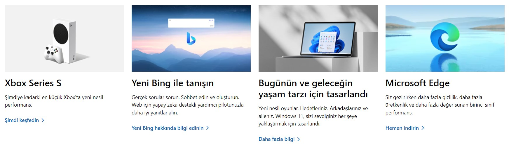

# Instructions  

  ** Aşağıdaki görüntüyü elde edecek şekilde bir tasarım yapınız **

  

  ## Steps
  1. Yerleşimi ayarlamak için table kullanabilirsiniz. Ancak bunun iyi bir yöntem olmadığını bilin. Şimdilik elimizdeki tek seçenek.
  2. Renkler için variables kullanın
  3. Beyaz alanları oluşturmak için padding ve margin kullanmaktan çekinmeyin
  4. width ve height kullanmayın
  5. Linklerin üzerine gelinince istediğiniz şekilde stil uygayın

